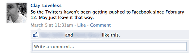

# Disconnecting Facebook and Twitter

**TL;DR: check out the embedded slide deck. It's great.**

I just disconnected my Facebook and Twitter accounts. I'm sure that most of the people who I'm "friends" with on Facebook don't care about much of what I often tweet about. I say "friends," because there's a big difference between the people I consider offline friends, and the people who's names I recognize.

My decision was influenced by a couple things. The link between the two broke for awhile, and none of my Facebook friends pinged me to say "dude, used to get updates from you 2–10x daily, are you dead?"

These two guys are not huge in my life — one is a former co-worker, the other is a high school friend of my brother's. Best that could be said is that they're friendly acquaintances, whom I have no particularly strong feelings about either way. However, my tweets-to-Facebook bridge has been irritating enough to them that they dropped a finger on a "Like" click in favor of me shutting up.

The bridge magically repaired itself a few days ago, just in time for my shitstorm over Twitter instructing its platform team to flip off the majority of their developer community. A few friends (whom I interact with mostly on Facebook) emailed me to let me know.

I then came across this excellent slide deck:

[**The Real Life Social Network v2**](http://www.slideshare.net/padday/the-real-life-social-network-v2) by [Paul Adams](http://www.slideshare.net/padday)

… which really illustrated the importance of keeping circles separate. (I'm sure my family members don't understand, appreciate or approve of my profanity laced tweets, and I'm often aware of my teenaged niece when I drop F-bombs in my tweets.)

So, I'm cutting this link. I set it up originally because it was convenient. The convenience isn't working, nor is it appreciated by acquaintances on Facebook.

I'll likely be following this up with a culling of my friends on Facebook. LinkedIn is for my professional kind-of-know-you connections, Twitter is a soapbox with some interaction, and Facebook is … hard to define, other than a service that's continuing to drift in a direction that's at odds with what I think is how I want to engage with people online.
