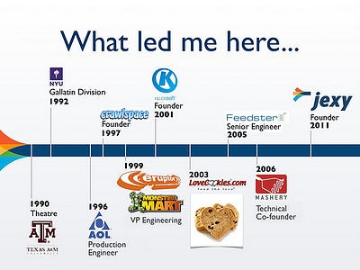

# Winning Some, Losing Some

One of the things that's coming up often as I work on fundraising for Jexy is my own background.
> "Do you really have what it takes to (raise money|run a company|launch a product|resonate with customers|find a market)?"
>
> — Everyone

Jexy isn't my first rodeo — it's just the first rodeo where I'm the guy doing the fundraising.

In this age that seems to glorify failure character-building experience, here's a timeline of what I've been up to (more or less) since high school graduation.

If you click through and mouse over each logo, you'll get a little summary of win/lose/draw status.

In every case, I've learned a ton. In fact, the best thing I learned in acting school and NYU's Gallatin Division is learning how to learn.

Am I a household name? No. Been on the cover of magazines? Nope. Had massive exits? Not really, though the Crawlspace sale to Eruptor in 1999 was financially significant on a personal scale. (Of course, I was young and stupid enough to blow all that cash!)

But do I know how to be scrappy, and come back for more? You bet your ass. Jexy is my doctoral thesis on all I've learned in the last 20 years. Hope it winds up being a story worth reading.
