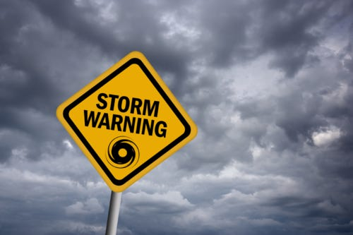

# Where There Are Clouds, It Sometimes Rains

When we started using Amazon EC2 at Mashery in the fall of 2006, it had been in private beta for about three days. Meaning they'd announced it was available, but you had to get an invite to use it.

We managed to score an invite, and I immediately began building Mashery's entire infrastructure around EC2. There was some angst over this decision internally and from our investors, but in retrospect it was one of the most important (and best!) decisions we made as a young company.

One of the things I remember vividly about the month in which I got my feet wet with EC2 was my take-away from reading the sparse documentation. It didn't come right out and say it, but the vibe between the lines was:

**WE MAY RIP THE RUG OUT FROM UNDER YOUR FEET AT ANY MOMENT.**

I had this sensation that ANY instance, at ANY time, would just blink out of existence without any warning (other than the ominous undertone of the documentation).

So we built for fault tolerance from the beginning.

[In the years since, I've seen services flail due to some EC2 hiccup or another](http://dennisfaust.posterous.com/amazon-aws-outage-brings-down-major-sites). The buzz around Infrastructre as a Service has shifted from 2006 "IF YOU USE IT YOU ARE CRAZY" tones to "YOU ARE CRAZY IF YOU DON'T USE IT", and with that shift has come this pleasant sensation that cloud infrastructure never goes down.

Snap out of it.

ANYTHING TECHNICAL has the potential to just up and crap the bed at ANY TIME. A service built without anticipating failure deserves the downtime it experiences.

I've heard all the ways of saying that planning for failover is premature optimization, but let's face it: if the service isn't built to fail well from the beginning, it's unlikely ever going to get around to adding graceful fault tolerance.

What most companies do when faced with Technical Failure Awakening is build a "we're down! Sorry!" page that lives on some other server, and points DNS to that page when their primary infrastructure fails. That's not a solution, folks, it's just a slightly better bedwetting than an completely unresponsive server. These guys have gone from failing their customers 100% to failing them 99.9%.

There are plenty of ways to get around this — it takes planning, and prioritization from the top.

Here's the catch: failing well is hard. In the current "OMG Launch Immediately and Iterate!" and "Customer Service is the Only Defensible Strategy" culture of internet companies, no one has paused to recognize that these are mutually near-exclusive. Planning to fail gracefully in ways that don't negatively impact customers is HARD WORK. It takes TIME, and simulated failures. (See: [Chaos Monkey](http://www.readwriteweb.com/cloud/2010/12/chaos-monkey-how-netflix-uses.php))

This is by no means a complete list of failure avoidance resources, but here are a couple of things to start with:

- [Dyn DNS Active Failover](http://dyn.com/enterprise-dns/dynect-platform/dynect-active-failover)
- [High Scalability Blog](http://highscalability.com/)
- [Multi-master Replication](http://en.wikipedia.org/wiki/Multi-master_replication)
- [Global Server Load Balancing](http://dyn.com/enterprise-dns/dynect-platform/dynect-traffic-management-gslb)

(No, I don't work for DynDNS — I just think they have a great product offering at a reasonable price. Similar services can be had from UltraDNS or Akamai if you're interested in paying 1999 prices.)

Amazon RDS doesn't currently support auto-failover replication between regions, which is the only thing that would have saved people from this week's outage. Those that are particularly concerned about having serious uptime can't be fully bound to what their cloud service offers them. Cloud services are super-awesome, but it may make sense to use them in conjunction with other techniques that aren't (yet) packaged up for mass consumption. Replication is often one of those hard problems that require custom configurations that off-the-shelf product features won't cover. Remember: that reality doesn't minimize the importance of replication to fault tolerance.

Go forth and stay dry under the clouds.

Photo credits: [iStockphoto](http://www.istockphoto.com/file_closeup.php?id=13558332), [CaptainD](http://captaind.deviantart.com/art/you-shall-not-pass-7505473)

Check out my follow-up post to this event:

[Failure Is Not An Option](/failure-is-not-an-option)
