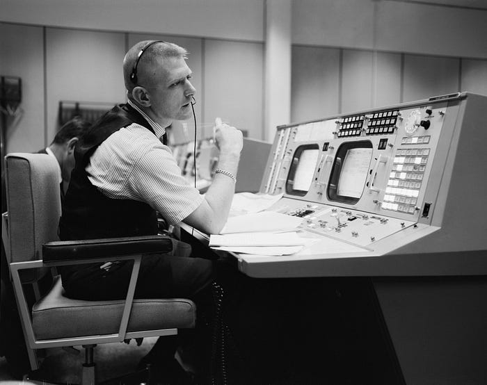
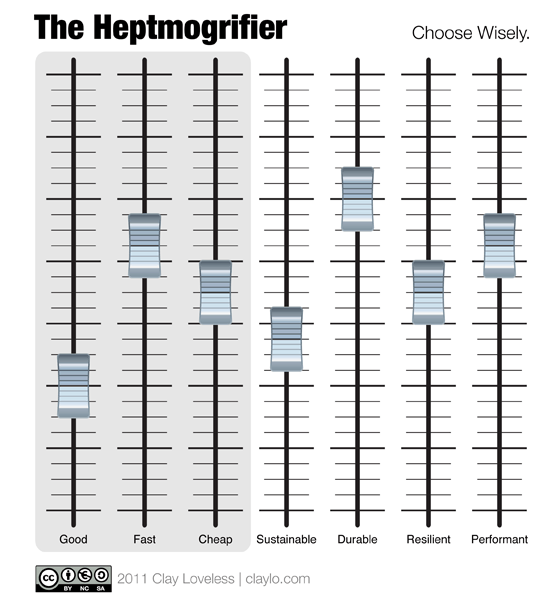

# Failure Is Not An Option

Kranz at his console on May 30, 1965, in the Mission Operations Control Room, [Mission Control Center](https://en.wikipedia.org/wiki/Christopher_C._Kraft_Jr._Mission_Control_Center), [Houston](https://en.wikipedia.org/wiki/Houston).

[Gene Kranz](http://en.wikipedia.org/wiki/Gene_Kranz) was 37 years old when [Apollo 13](http://en.wikipedia.org/wiki/Apollo_13), the space mission he served on as lead Flight Director, launched. A few days after takeoff, the Apollo 13 Service Module exploded, jeopardizing the lives of the three astronauts on board. While he never used the phrase "Failure Is Not An Option" (other than in the film version of the story), it was the attitude of mission control.

In light of the [AWS EC2 crisis](http://gigaom.com/cloud/more-than-100-sites-went-down-with-ec2-including-your-paas-provider/), which has left some companies with their services crippled or completely disabled for over 24 hours, it's a good time to reflect on whether or not failure is an option to you. I know that most of us aren't writing software controlling the launch codes, but we *are* writing software that businesses, and therefore people's livelihoods, are dependent upon.

[Evan Cooke](http://www.twitter.com/emcooke), Twilio's CTO, wrote [a great post](http://www.twilio.com/engineering/2011/04/22/why-twilio-wasnt-affected-by-todays-aws-issues/) yesterday about how they managed to avoid any downtime. Pay attention to his update at the end of the post regarding how they've resisted EBS adoption.

**By the way…**  
At Mashery, we did extensive I/O testing on EBS versus RAID0 striped ephemeral stores, and there's no comparison. [RAID0 blows EBS away on performance.](http://blog.rightscale.com/2008/08/20/amazon-ebs-explained/#comment-445) Sure, you don't get the magical features off-the-shelf that Amazon provides for EBS, but then again … how magical are those features feeling today?

So ask yourself: is failure an option?

## The Choice is Yours

([Link](http://www.hark.com/clips/yrprjtvbmq-you-must-choose-but-choose-wisely))

When you're designing a system, you make tradeoffs. Choices. You must choose among variables like:

- Development speed/Time-to-market
- Development cost
- Ongoing costs
- Quality
- Performance
- Resiliency
- Durability

… just to name a few. Most people are familiar with the [Project Triangle](http://en.wikipedia.org/wiki/Project_triangle): "Good, Fast and Cheap: Choose any two" … but a simple triangle doesn't fit today's projects.

Most of the above items are self-explanatory, but I specifically separated resiliency and durability. A project/site/service may be resilient, which to me means it can go down and bounce back quickly. A durable site, on the other hand, won't go down. There's also a variance between the two on whether or not a site can rebound *without data loss*. A resilient service may bounce back, but suffer data loss … or, perhaps a resilient site doesn't have any data to worry about. There aren't many services that have value without *some* data, but many services provide value with minimal data dependencies.

## Heed The Heptmogrifier

As a handy reminder, I give you … The Heptmogrifier. Adjust as you like, but remember that your head will explode if you try to set all sliders to the max.

(I know "performant" isn't really a word, but it's used often enough that I'll deal with those complaints.)

This is what you're really working with when you deal with "internet-scale" applications.

The traditional good/fast/cheap tradeoffs will dictate the project's code quality. But those three factors are influenced heavily by the choices you make about the other four.

**Sustainable:** How much is this thing going to cost to keep running, given the choices made?

**Durable:** How susceptible is the service to failure? More importantly, how likely is data loss as a result of failure?

**Resilient:** How quickly can the service recover from a failure? It's extremely difficult for a service to have *zero* downtime. So, even if you're building something durable, factor in what it takes to failover. Example: a DNS TTL of 60 seconds, with an every-30-second health check and a two-strikes policy, might take as much as 120 seconds to detect a failure and switch traffic elsewhere.

**Performant:** How do the choices you make in other areas affect performance overall? Or, perhaps some aspects of the system will need performance expectation adjustments based on the choices you make around durability?

Not all of these choices are as painful as they sound. A [comment on my previous post](http://claylo.tumblr.com/post/4817029650/where-there-are-clouds-it-sometimes-rains#comment-189991649) suggested that latency was too high across regions to consider. This simply isn't true for most applications. A half-second lag for master-slave replication across the United States is nothing when you consider that you'll be able to cut over to that other region in 2 minutes, promote that slave to a master, and be back up and running before most people finish reading the TechCrunch article about how the sky has fallen.

## Talk to Your Investors/Stakeholders

They probably don't care about the technical details, but they will certainly care about their investment going down the tubes because the service they invested in goes toes up due to incomplete failure planning. It's not a popular conversation, and "how will I scale?" is often how questions about uptime and availability are framed.

**It's time to think about it differently.** I agree that scaling to millions of users is a nice problem to have — a "high class problem," as a friend is fond of saying. However, surviving an outage like what's happening with Amazon EC2 East is an entirely different story. Your service may find it difficult to get to 10,000 users if it faceplants every time an upstream provider has a hiccup. (Investors, please weigh in below — feel free to call bullshit if I'm off the mark.) Make sure you and your other stakeholders are on the same page.

Take control of your destiny.

Reject failure as an option.

In doing so, you'll not only live to fight another day, you'll be around to take customers your competitors alienated by choosing … poorly.

Image credits: [NASA](http://en.wikipedia.org/wiki/File:KranzConsole.jpg), [Indiana Jones and The Last Crusade](http://www.webomatica.com/wordpress/2008/06/27/top-ten-moments-from-the-indiana-jones-movies/)

This post relates to this one, published a day prior:

[Where There Are Clouds, It Sometimes Rains](/where-there-are-clouds-it-sometimes-rains)

*Originally published at* [*claylo.tumblr.com*](http://claylo.tumblr.com/post/4844798650/failure-is-not-an-option) *on April 22, 2011.*

