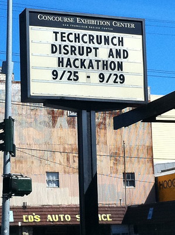
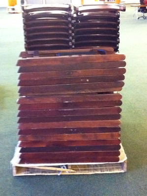

# Operation Hackbutt

If you follow me on Twitter, you probably know that I participated in
the TechCrunch Disrupt Hackathon in San Francisco September 25-26.
Unfortunately, I had to bow out in the wee hours due to illness.

What you may not know is that my seating was sponsored. I was the guy
with the comfy chairs. Not one, but *two*.

You see, the chairs that are provided at events like this are designed
for stacking, not for sitting. Sit in those things long enough, and
pretty soon all you can really think about is how much it sucks to be
sitting in them. I felt like my performance in May's TechCrunch
Hackathon was really impacted by [how shitty the chairs
were](https://twitter.com/claylo/status/14550489749).

I got to thinking a week or so before the San Francisco event that it
would really be a true test of "chairs designed for long periods of
sitting," if I were able to get my hands on one. So began what my
co-workers at Mashery dubbed ... Operation #Hackbutt.

I told [my sob
story](https://twitter.com/claylo/status/25243395978)
on Twitter to both
[\@Steelcase](https://twitter.com/steelcase)
and
[\@hermanmiller](https://twitter.com/hermanmiller)
in hopes of inspiring one of them to provide me with a top-of-the-line
ergonomic chair. Something that they could say "yes, hackers of the
world, this is what you should dream of sitting on" with, to a room
full of 300+ hackers. After all, we sit for a living, do we not?

To my surprise and delight, both Steelcase and Herman Miller responded
to my plea. With less than 48 hours before the event began, I had
commitments from both companies to provide me with a chair. How awesome
was that? **So** awesome.

### The Cockpit

The Steelcase contender: The Cockpit. Also known as [the Leap
chair](https://www.steelcase.com/products/office-chairs/leap/),
with The Leather and The Chrome. I was already familiar with this chair,
since we have many of the fabric and not-chrome flavors of Leap at the
[Mashery World
Headquarters](http://twitpic.com/2t40pk).

There's no question that Leap is a great chair. I've spent the better
part of three years sitting in the fabric and not-chrome version.
However, I can now attest to the fact that The Leather and The Chrome
make a big difference. It's not just about how it looks, but about how
it feels. The dude working the floor at the Steelcase showroom in San
Francisco where I picked up the chair called it "The Cockpit," and he's
right on the money. It's very easy to forget the chair entirely when
you're sitting in it \-- it's just an extension of your body.

The bad news: with The Leather and The Chrome, Leap is around \$1,200 a
pop. A great chair, no doubt.

### The Exoskeleton

Herman Miller's
[Embody](https://www.hermanmiller.com/products/seating/office-chairs/embody-chairs/)
chair is like getting into one of those bad-ass killing machines
featured in Avatar. I could feel my vertebrae separating as it supported
parts of my upper back that I'm not used to feeling in regard to a
chair the first time I sat in it.

It's got a wide seat for all kinds of butts, and the way the back gets
narrow towards the top allows for a broader range of backward motion for
your elbows ... which you don't really think about until you're in a
chair that allows for it. It was a unique sitting experience, and
definitely one that earned me a lot of jealous looks from fellow
hackers. The downside: list price for this puppy is a whopping \$1,700.
Good luck getting your boss to spring for that.

### Conclusion

Both chairs were excellent. I swapped between them throughout the event.
I was there just over 14 hours, so I had plenty of time to sit in both
chairs. After midnight, fellow hackers were asking for turns in each
chair, just to have a few minutes of a break from the craptastic chairs
they'd been sitting in.

I'd recommend either one. If I could afford it, I'd probably go for
the Embody, simply to try to recreate that lifting sensation I got in my
spine when I first tried it out. But after spending years in a Leap, I
can also say you can't go wrong with that chair.

Take it from me: a high-quality chair truly can make a difference in the
quality of output. Many thanks to
[\@Steelcase](https://web.archive.org/web/20130301132347/http://twitter.com/Steelcase)
and
[\@hermanmiller](https://web.archive.org/web/20130301132347/http://twitter.com/hermanmiller)
for making Operation Hackbutt a success! That in itself was just cool.

### (Some of) The Tweets

<!-- 6:15pm -->
<!-- 6:18pm -->
<!-- 6:44pm -->
<!-- 6:48pm -->
<!-- 6:55pm Sep 25 -->
<!-- 7:15pm -->
<!-- 7:32pm Sep 25 -->
<!-- 7:36pm -->
<!-- 7:37pm -->
<!-- 8:31pm -->
<!-- 8:42pm Sep 25 -->
<!-- 8:47pm -->
<!-- 9:05pm -->
<!-- 9:08pm Sep 25 -->
<!-- 9:14pm -->
<!-- 9:15pm Sep 25 -->
<!-- 9:26pm -->
<!-- 10:00pm -->
<!-- 10:01pm -->
<!-- 10:06pm Sep 25 -->
<!-- 10:06pm -->
<!-- 10:09pm Sep 25 -->
<!-- 10:47pm -->
<!-- 11:25pm  -->
<!-- 11:38pm -->
<!-- 12:00am -->
<!-- 12:46am -->
<!-- 12:54am -->
<!-- 12:55am -->
<!-- 1:03am -->
<!-- 1:05am -->
<!-- 1:24am -->
<!-- 2:45am -->
<!-- 2:53am -->
<!-- 4:13 am -->
<!-- 4:19am -->
<!-- 5:49am -->
<!-- 6:06am -->
<!-- 6:14am Sep 26 -->
<!-- 6:40am -->
<!-- 6:59 am -->
<!-- 8:05am -->
<!-- 1:51pm Sep 26 -->
<!-- 7:25pm -->
